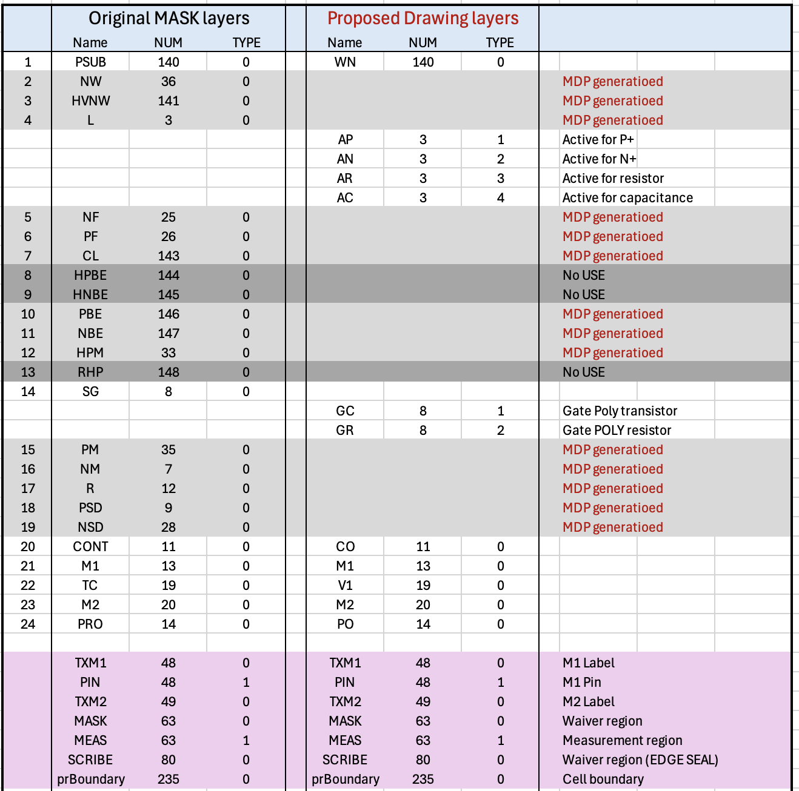
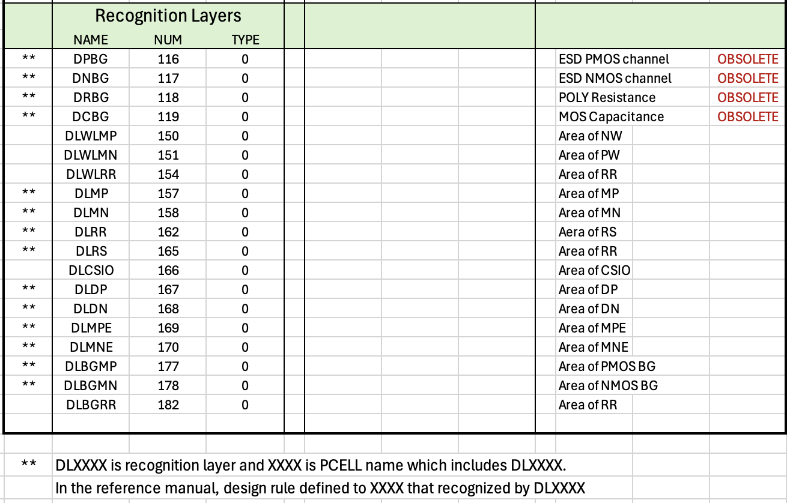

# Drawing vs Mask Layers
by jun1okamura 
---

The purpose of **Drawing Layers** is to simplify layout creation and reduce the number of layers a designer must work with when generating GDSII layout data. In contrast, **Mask Layers** are defined to support the semiconductor manufacturing process through photolithography steps. The figure below illustrates the difference between the two layer concepts:

## Concept of Drawing Layer

1. There are four types of active regions are defined: AP, AN, AR, and AC, which correspond to diffusion areas for CMOS, resistors, and capacitors.

2. Polysilicon shapes are described using two layers: PG for CMOS gates and PR for polysilicon resistors. 
   
3. All implant-related Mask Layers are automatically generated later in the flow during the Mask Data Preparation (MDP) phase, based on these Drawing Layers.

### Original: Concept of Device Layers (Recognition Layers)

On the other hand, the original IP62 PDK encourages the insertion of many **DLXXX** recognition layers to identify various device regions and apply specific DRC rules accordingly. This approach requires designers to rely heavily on parameterized cells (PCells), which encapsulate not only complex device geometries but also critical recognition layers that ensure correct operation of DRC and LVS processes. 

Because of this, designers are discouraged from flattening PCells or manually drawing devices such as transistors, since the DRC does not validate design rules around such handcrafted elements, and consistency between recognition layers (**DLXXX**) and Mask Layer combinations for implant processes is not checked.

### Proposal: (Conjunction betweeb Drawing layers and DLXXX layers)

As with implant Mask Layers, DLXXX layers can be generated from Drawing layers, so the MDP process also includes DLXXXX layer generation for the foundry sign-off as a compromise approach.

### Mask Data Preparation: 

See following steps as a proposal.

