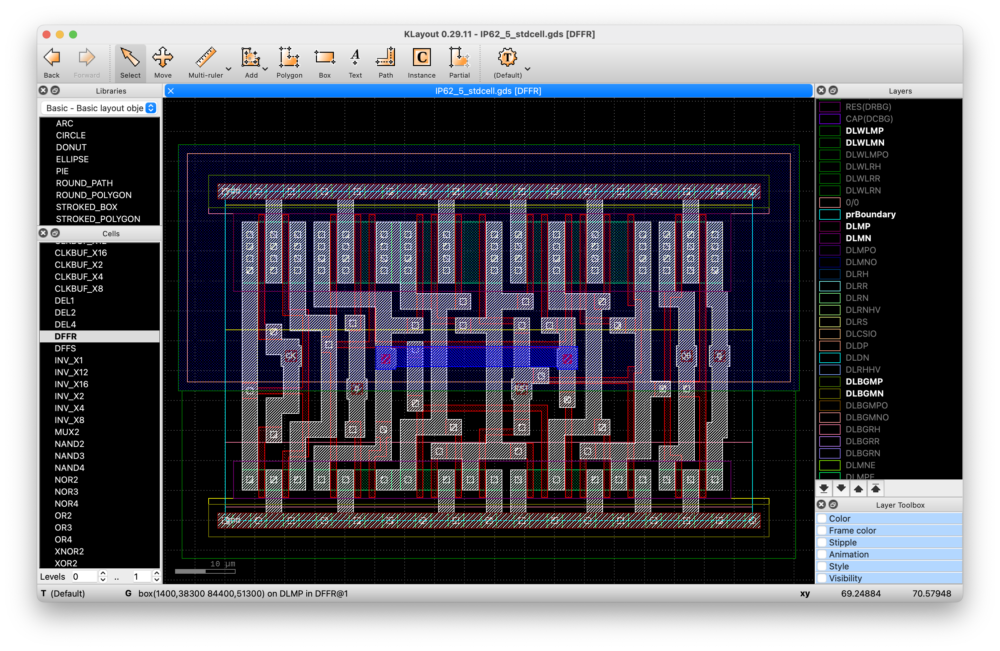
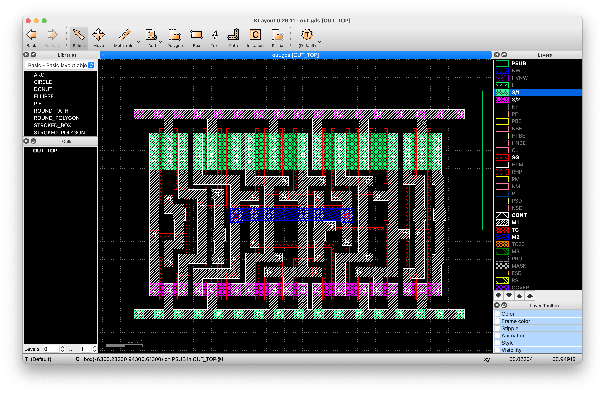
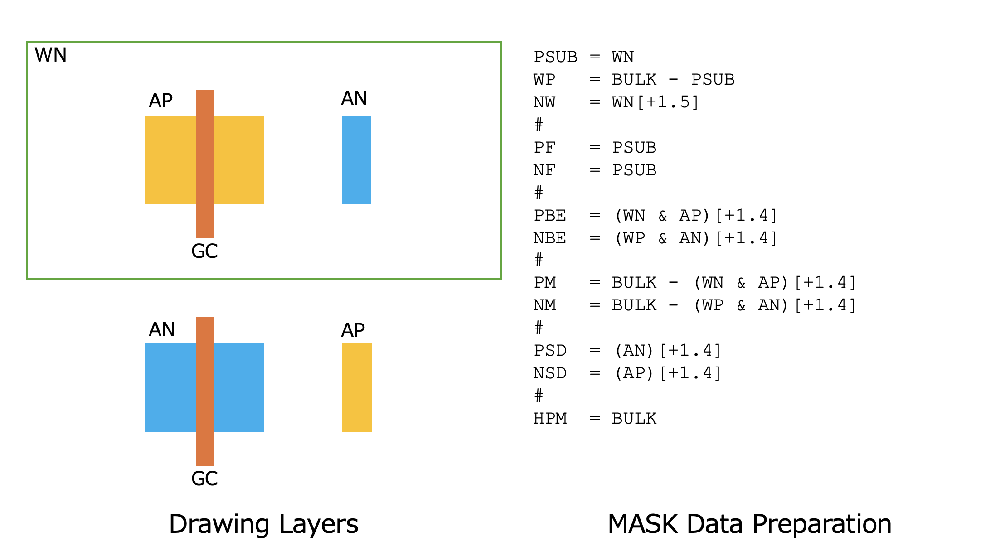
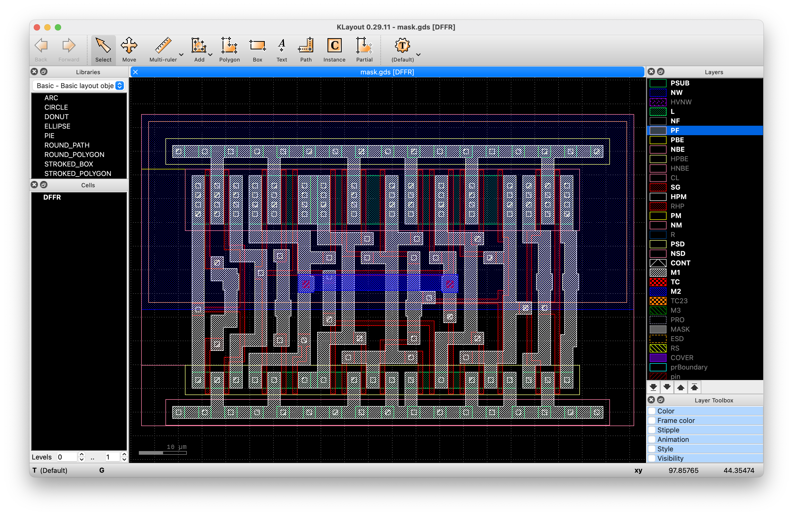
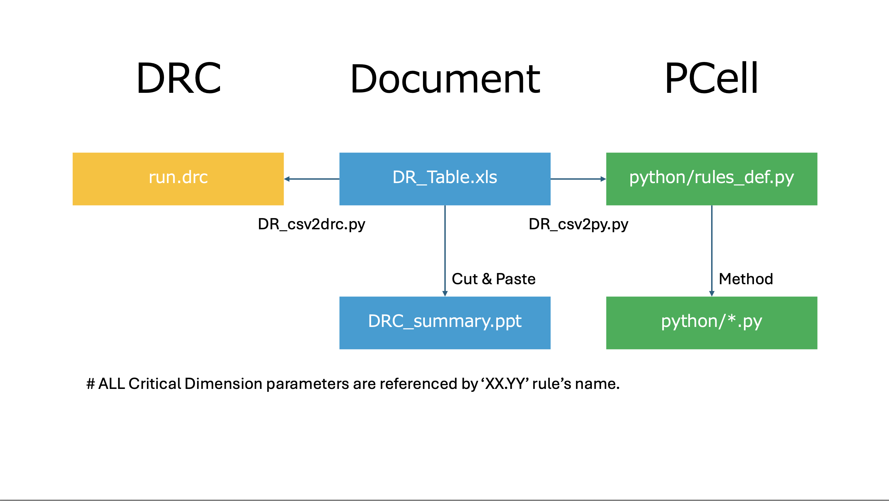

# Manifesto: PDK renewal for TR-1um technology
by jun1okamura 
---

## Action propoals

1. Introduce **Drawing layers** rather than **Mask layers** for simplify the layout design.

2. Cleanup any recongnition layer such as **DLXXX** as less as possible for eliminate inconsistency.

3. Develop new data processing to reconstruct **Mask layers** from **Drawing layers**.

4. In addition, it can reconstructs **DLXXX** from **Drawing layers** since TokaiRika's DRC sign-off.
 
### Original: (Mask layers + recognition layers)

The original IP62 PDK recommends that designers use only the **Mask layers** for layout artwork and strictly rely on PCells for device instantiation. These PCells encapsulate complex layout structures, including essential **recognition layers** such as **DLXXX**, which are critical for proper device identification during DRC/LVS processes.

Flattening any PCell or manually drawing devices (e.g., transistors) without using the provided PCells is strongly discouraged, as:

- The DRC runsets do not validate design rules for manually drawn device structures.

- There is no consistency check between the required DLXXX recognition layers and the actual mask layers used to define implants and other process steps.

This means that non-PCell-based layouts risk producing unverifiable or incorrect designs, as the flow assumes a fixed mapping between mask layers and recognition layers within PCell definitions.

The TR-1µm CMOS process requires:

- 17 mask layers, representing physical fabrication layers such as diffusion, poly, contact, metal, implant, etc.
- 6 recognition layers (like **DLXXX**), used for device extraction, LVS, and technology file mapping.

Total: 23 layers required in layout for proper rule checking and device recognition, as below.

### Proposal: (Drawing layers)

Introduction of Simplified Drawing Layers for Layout Artwork. To streamline the layout creation process and significantly reduce the complexity and number of design rules, we propose shifting from the **Mask layer**-based approach to a simplified **Drawing layer**-based methodology.

Key Changes

- Replace mask layers with drawing layers tailored specifically for layout artwork.

- Introduce two active region layers: **AP** (Active P-region) and **AN** (Active N-region)

- Remove all implant-related layers except for: **PSUB** (Denoting the N-well region, renamed to **WN** for clarity)

The simplified set includes **only 8 drawing layers**, replacing the original 23 layers (17 mask + 6 recognition layers). This dramatic reduction in layers leads to:

- Lower design complexity

- Reduced DRC rule count

- Faster layout iteration cycles

- Better accessibility for education and open-source community contributions

This drawing-based abstraction is particularly beneficial in educational or prototyping contexts, where: Full physical verification is not immediately required, and simplified LVS/DRC setups allow faster onboarding and easier adoption of OSS PDK flows

### Mask Data Preparation: 

Eliminated Mask layers, such as **NW**, **NF**,**PF**,**PBE**,**NBE**,**PM**,**NM**,**PSD**,**NSD**, and **HPM** are automatically regenerated from the simplified drawing layers (e.g., AP, AN, PSUB, etc.) through a dedicated **MDP** (Mask Data Preparation) step, as described below:

Important: This MDP step is performed only during the final stages of chip preparation—such as full-chip DRC/LVS/PEX validation or aggregation of multiple dies for MPW (shuttle) runs. 

Designers do not need to manually create or modify these mask layers. This abstraction significantly improves such as ease of use for educational or rapid prototyping purposes and maintainability of layout rules and PDK infrastructure.

This MDP can generate 17 MASK layers from 8 Drawing layes with Klayout DRC processing as below.

6 recoginiton layers are also can regenerate propoerly with MDP process.

### PCell and DRC integrity

**Design Rules** for Drawing Layers are re-defined on [TR-1um_Drawing_Layer_DR_Table](../TR-1um_Drawing_Layer_DR_Table.xlsx) Excell file and all Critical Dimensions are refrenced to the [TR-1um_Drawing_Layer_DR_Table](../TR-1um_Drawing_Layer_DR_Table.cvs) CVS file from the Excell file.

Under **Tools** directory, there are python script files which auto generate [run.drc](../libs.tech/klayout/drc/run.drc) as DRC runset and [rules_def.py](../libs.tech/klayout/python/cells/rules_def.py) for PCell.

